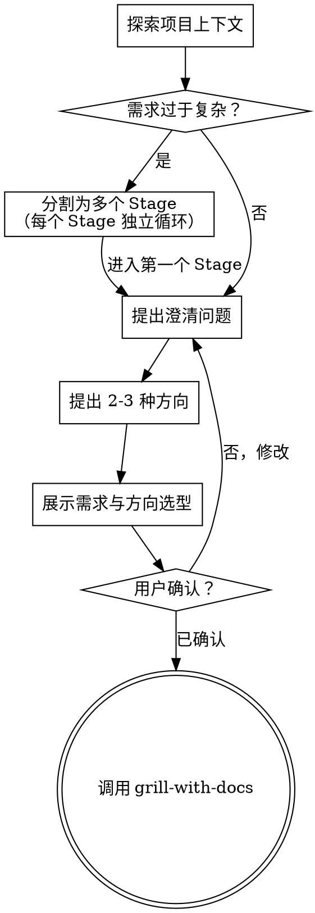

# 将想法转化为需求与方向

通过自然的协作对话，将想法转化为明确的需求边界和方向选型。

首先理解当前项目上下文，然后通过提问来细化想法。一旦需求明确且方向选定，交接给 grill-with-docs 进行领域对质和方案精炼。

**开始时声明：** "我正在使用 brainstorming 技能探索需求和方向。"

<HARD-GATE>
在需求和方向选型获得用户批准之前，不得调用任何实现技能、编写任何代码、搭建任何项目或采取任何实现行动。这适用于每个项目，无论看起来多简单。
</HARD-GATE>

## 何时不使用 brainstorming

- 修复已知 bug → 使用 systematic-debugging
- 审查已有代码 → 使用 code-review
- brainstorming 用于创造性工作：新建功能、添加能力、修改行为

## 反模式："这个太简单了，不需要设计"

每个项目都要经过这个过程。一个待办列表、一个单函数工具、一个配置变更——所有这些都需要。在"简单"的项目中，未经审视的假设造成的浪费最多。产出可以很短（对于真正简单的项目只需几句话），但你必须在获得批准后才交接。

## 检查清单

你必须为以下每项创建任务，并按顺序完成：

1. **探索项目上下文**——检查文件、文档、最近提交
2. **评估复杂度**——判断需求是否过于复杂以至于无法用单一设计覆盖。若需求包含多个独立子系统或规模过大，应将其分割为多个 Stage，每个 Stage 独立经历完整循环。参见下方多 Stage 分割部分。
3. **提出澄清问题**——理解目的/约束/成功标准
4. **提出 2-3 种方向**——包含权衡和你的推荐
5. **确认需求和方向**——在对话中向用户展示需求边界和选定方向，获得确认
6. **转入领域对质**——调用 grill-with-docs 技能

## 流程



**终止状态是调用 grill-with-docs。** brainstorming 之后唯一调用的技能是 grill-with-docs。

## 过程

**理解想法：**

- 首先了解当前项目状态（文件、文档、最近提交）
- 在提出详细问题之前，先评估范围：如果请求描述了多个独立子系统（例如"构建一个包含聊天、文件存储、计费和分析的平台"），应立即标记。不要花时间细化一个需要先分解的项目的细节。
- 如果项目太大无法用单一设计覆盖，按下方多 Stage 分割规则将其分解为多个 Stage
- 展示时，如果需要多 Stage，先展示 Stage 划分方案（每个 Stage 的范围和依赖），获得用户确认后再进入第一个 Stage 的详细探索
- 不断向用户询问计划的各个方面，直到双方达成共识。逐步深入设计树，逐一解决决策之间的依赖关系——先确定上层决策，再基于其结果向下展开依赖它的子决策，避免在前置决策未定时跳到下游细节。
- 尽可能使用选择题，但开放式问题也可以
- 专注于理解：目的、约束、成功标准

**探索方向：**

- 提出 2-3 种不同的方向，包含权衡
- 以对话方式呈现选项，附上你的推荐和理由
- 以你推荐的选项为主导，解释为什么
- 方向选型关注「走哪条路」，不深入「路怎么走」的细节 — 后者交给 grill-with-docs

**展示需求与方向：**

- 一旦你相信你理解了要构建的内容，展示：
  - 需求边界：做什么、不做什么
  - 成功标准：如何判断完成
  - 方向选型：选定的技术路线/架构方向及理由
- 如果需要多 Stage，展示 Stage 划分方案：列出每个 Stage 的范围、各 Stage 间的依赖关系、建议的推进顺序
- 询问用户是否正确，准备好回溯和修改

**在现有代码库中工作：**

- 在提出方向之前探索当前结构。了解现有模式。
- 现有代码中存在影响工作的问题时（例如文件过大、边界不清、职责纠缠），在方向选型中标注需要处理的技术债务。
- 不要提出无关的重构。专注于服务当前目标的内容。

## 产出

brainstorming 的产出是一份简明的需求与方向确认，保存到 `docs/brainstorming/YYYY-MM-DD-<slug>.md`，包含：

1. **需求边界** — 做什么、不做什么、成功标准
2. **方向选型** — 选定的技术路线/架构方向、选择理由、排除的替代方案
3. **Stage 划分**（如适用）— 各 Stage 范围、依赖、顺序，以及 Stage 进度清单

### Slug 命名

确认需求时同时确定一个 **slug** 作为该功能在所有后续文档中的标识符。规则：

- 使用 kebab-case 英文，如 `user-auth`、`billing-migration`
- 后续所有 skill 产出的文件必须沿用同一 slug

### 多 Stage 文件命名

文件名中的日期为该文件创建时的日期。brainstorming 索引文件使用初始创建日期；后续 Stage 的 grill/plan 文件使用各自创建时的日期。

无 Stage 时，各环节产出直接使用 slug：

```
docs/brainstorming/2026-05-18-user-auth.md
docs/grill/2026-05-18-user-auth.md
docs/plans/2026-05-18-user-auth.md
```

有 Stage 时，grill 和 plan 的文件名追加 `-stage-N` 后缀：

```
docs/brainstorming/2026-05-18-user-auth.md          ← 唯一索引，含所有 Stage 范围和进度
docs/grill/2026-05-18-user-auth-stage-1.md
docs/grill/2026-05-25-user-auth-stage-2.md
docs/plans/2026-05-18-user-auth-stage-1.md
docs/plans/2026-05-25-user-auth-stage-2.md
```

### Stage 进度追踪

存在多 Stage 时，产出文件中包含 Stage 进度清单和每个 Stage 的独立章节。执行层（executing-plans 或 subagent-driven-development）在每个 Stage 完成后更新此清单。会话中断后可通过此文件恢复进度。

```markdown
# user-auth 需求与方向

## 需求边界
[功能级的整体需求边界]

## 方向选型
[功能级的方向选型]

## Stage 进度

- [x] Stage 1 — 用户认证基础
- [ ] Stage 2 — 权限系统
- [ ] Stage 3 — OAuth 集成

---

## Stage 1: 用户认证基础

### 范围
[该 Stage 的具体范围]

### 成功标准
[该 Stage 的成功标准]

## Stage 2: 权限系统

### 范围
...

### 成功标准
...
```

grill-with-docs 读取此文件时，根据 Stage 进度清单定位当前未完成的 Stage，读取对应的 Stage 章节作为输入。

这份文档是 grill-with-docs 的输入。grill-with-docs 负责将方向深化为完整设计：精炼术语、验证边界场景、确认接口和实现细节。

## 核心原则

- **优先选择题**——尽可能比开放式问题更容易回答
- **严格 YAGNI**——从需求中移除不必要的功能
- **探索替代方向**——在确定之前始终提出 2-3 种方向
- **逐层共识**——沿设计树自顶向下推进，每层决策达成共识后再深入下一层；决策之间存在依赖时，先解决被依赖的决策
- **保持灵活**——当某些事情不合理时回溯和澄清
- **不越界**——不深入实现细节、接口定义、错误处理策略等，这些是 grill-with-docs 的职责

## 多 Stage 分割

当用户需求过于复杂、包含多个独立子系统或规模过大以至于单一设计无法有效覆盖时，将需求分割为多个 Stage。每个 Stage 对应一个里程碑或阶段性目标，如"后端数据层迁移"、"前端组件迁移"。

**分割规则：**

- 按里程碑或阶段性交付目标识别分割点，非按子系统技术边界
- 确认各 Stage 之间的依赖关系和推进顺序（Stage 之间严格串行）
- 向用户说明 Stage 划分方案：每个 Stage 的范围、各 Stage 的关系、推进顺序
- 获得用户对划分方案的确认后，对第一个 Stage 进入 grill-with-docs

**每个 Stage 的独立循环：**

每个 Stage 拥有自己完整的 brainstorming→grill-with-docs→writing-plans→executing 循环：

1. 对当前 Stage 提出澄清问题、探索方向、确认需求
2. 用户确认后，调用 grill-with-docs 对该 Stage 进行领域对质
3. grill-with-docs 完成后调用 writing-plans 创建实现计划
4. 实现当前 Stage
5. 当前 Stage 完成后，回到步骤 1 对下一个 Stage 进行 brainstorming

不要在所有 Stage 的设计都完成后再开始实现。每个 Stage 完成后立即推进到下一个 Stage。

### Stage 续接（非首次进入）

执行层完成 Stage N 后，会向用户交接并建议回到 brainstorming 对 Stage N+1 进行续接。此时不需重跑完整的探索流程：

1. 读取已有的 brainstorming 产出文件，定位当前未完成的 Stage
2. 检查该 Stage 的范围和成功标准是否仍然准确——前序 Stage 的执行可能带来新认知
3. 如需修订：更新该 Stage 章节，向用户确认
4. 如无修订：直接将该 Stage 章节传递给 grill-with-docs

续接时不重跑完整的探索流程，除非用户明确要求重新评估整体方向。
