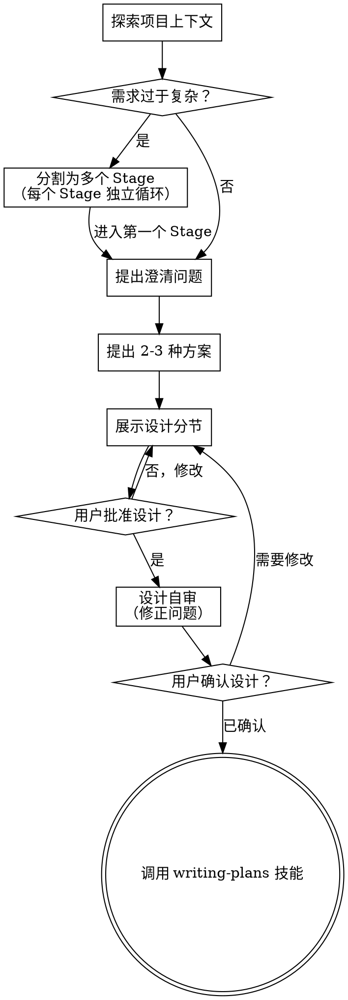

# 将想法转化为设计

通过自然的协作对话，将想法转化为完整的设计和规格。

首先理解当前项目上下文，然后通过提问来细化想法。一旦理解了你将要构建的内容，就展示设计并获取用户批准。

<HARD-GATE>
在展示设计并获得用户批准之前，不得调用任何实现技能、编写任何代码、搭建任何项目或采取任何实现行动。这适用于每个项目，无论看起来多简单。
</HARD-GATE>

## 反模式："这个太简单了，不需要设计"

每个项目都要经过这个过程。一个待办列表、一个单函数工具、一个配置变更——所有这些都需要。在"简单"的项目中，未经审视的假设造成的浪费最多。设计可以很短（对于真正简单的项目只需几句话），但你必须在获得批准后才展示。

## 检查清单

你必须为以下每项创建任务，并按顺序完成：

1. **探索项目上下文**——检查文件、文档、最近提交
2. **评估复杂度**——判断需求是否过于复杂以至于无法用单一设计覆盖。若需求包含多个独立子系统或规模过大，应将其分割为多个 Stage，每个 Stage 独立经历 设计→计划→实现 循环。参见下方多 Stage 分割部分。
3. **提出澄清问题**——理解目的/约束/成功标准
4. **提出 2-3 种方案**——包含权衡和你的推荐
5. **展示设计**——按复杂度分节展示，每节获得用户批准
6. **设计自审**——快速检查占位符、矛盾、歧义、范围（见下方）
7. **用户确认设计**——在对话中向用户展示完整设计并获得确认
8. **转入实现**——调用 writing-plans 技能创建实现计划

## 流程

**终止状态是调用 writing-plans。** 不要调用任何其他实现技能。brainstorming 之后唯一调用的技能是 writing-plans。

## 过程

**理解想法：**

- 首先了解当前项目状态（文件、文档、最近提交）
- 在提出详细问题之前，先评估范围：如果请求描述了多个独立子系统（例如"构建一个包含聊天、文件存储、计费和分析的平台"），应立即标记。不要花时间细化一个需要先分解的项目的细节。
- 如果项目太大无法用单一设计覆盖，按下方多 Stage 分割规则将其分解为多个 Stage
- 展示设计时，如果需要多 Stage，先展示 Stage 划分方案（每个 Stage 的范围和依赖），获得用户确认后再进入第一个 Stage 的详细设计
- 尽可能使用选择题，但开放式问题也可以
- 专注于理解：目的、约束、成功标准

**探索方案：**

- 提出 2-3 种不同的方案，包含权衡
- 以对话方式呈现选项，附上你的推荐和理由
- 以你推荐的选项为主导，解释为什么

**展示设计：**

- 一旦你相信你理解了要构建的内容，就展示设计
- 如果需要多 Stage，先展示 Stage 划分方案：列出每个 Stage 的范围、各 Stage 间的依赖关系、建议的推进顺序。用户确认后再对第一个 Stage 展开详细设计。
- 根据复杂度调整每节的篇幅：简单的几段话，复杂的可写到 200-300 字
- 每节之后询问到目前为止是否正确
- 覆盖：架构、组件、数据流、错误处理、测试
- 准备好回溯和澄清，如果有不合理的地方

**为隔离和清晰而设计：**

- 将系统分解为较小的单元，每个单元有一个明确的目的，通过定义良好的接口通信，可以独立理解和测试
- 对于每个单元，你应该能够回答：它做什么、如何使用它、它依赖什么？
- 能否在不阅读内部实现的情况下理解一个单元的功能？能否在不破坏使用者的情况下修改内部实现？如果不能，边界需要改进。
- 更小、边界清晰的单元也更容易处理——你更容易理解可以一次性放入上下文中的代码，当文件聚焦时编辑也更可靠。当文件变得很大时，这通常是它做了太多事情的信号。

**在现有代码库中工作：**

- 在提出更改之前探索当前结构。遵循现有模式。
- 现有代码中存在影响工作的问题时（例如文件过大、边界不清、职责纠缠），在设计中包含有针对性的改进——就像一个优秀的开发者在工作中改进代码一样。
- 不要提出无关的重构。专注于服务当前目标的内容。

## 设计之后

**设计自审：**
在向用户展示设计之前，用新的眼光审视：

1. **占位符扫描：** 有"TBD"、"TODO"、不完整的部分或模糊的需求吗？修正它们。
2. **内部一致性：** 有互相矛盾的章节吗？架构与功能描述匹配吗？
3. **范围检查：** 这个设计是否聚焦到足以生成单个实现计划，还是需要进一步分解？
4. **歧义检查：** 是否有需求可以被两种不同方式解释？如果有，选择一种并明确表达。

在向用户展示之前修正所有问题。

**用户确认环节：**
设计自审通过后，在对话中向用户展示完整设计并确认：

> "设计如上。在开始编写实现计划之前，请确认是否需要任何修改。"

等待用户回复。如果他们要求修改，进行修改并重新确认。只有在用户确认后才继续。

**实现：**

- 调用 writing-plans 技能创建详细的实现计划
- 不要调用任何其他技能。writing-plans 是下一步。

## 核心原则

- **优先选择题**——尽可能比开放式问题更容易回答
- **严格 YAGNI**——从所有设计中移除不必要的功能
- **探索替代方案**——在确定之前始终提出 2-3 种方案
- **增量验证**——展示设计，在继续之前获得批准
- **保持灵活**——当某些事情不合理时回溯和澄清

## 多 Stage 分割

当用户需求过于复杂、包含多个独立子系统或规模过大以至于单一设计无法有效覆盖时，将需求分割为多个 Stage。每个 Stage 对应一个里程碑或阶段性目标，如"后端数据层迁移"、"前端组件迁移"。

**分割规则：**

- 按里程碑或阶段性交付目标识别分割点，非按子系统技术边界
- 确认各 Stage 之间的依赖关系和推进顺序（Stage 之间严格串行）
- 向用户说明 Stage 划分方案：每个 Stage 的范围、各 Stage 的关系、推进顺序
- 获得用户对划分方案的确认后，对第一个 Stage 展开详细设计

**每个 Stage 的独立循环：**

每个 Stage 拥有自己完整的 设计→计划→实现 循环：

1. 对当前 Stage 提出澄清问题、探索方案、展示详细设计
2. 用户确认当前 Stage 的设计后，调用 writing-plans 为该 Stage 创建实现计划（保存为 `YYYY-MM-DD-<功能名称>-Stage-N.md`）
3. 实现当前 Stage
4. 当前 Stage 完成后，回到步骤 1 对下一个 Stage 进行 brainstorm

不要在所有 Stage 的设计都完成后再开始实现。每个 Stage 完成后立即推进到下一个 Stage 的设计阶段。
