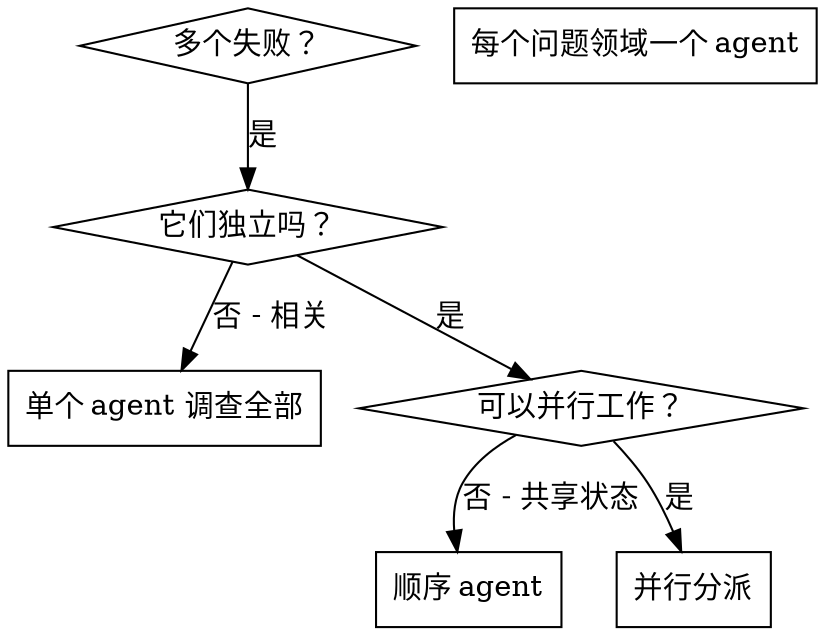

# 并行分派 Agent

## 概述

你将任务委派给具有隔离上下文的专门 agent。通过精确制定它们的指令和上下文，确保它们保持专注并成功完成任务。它们不应继承你的会话上下文或历史——你精确构建它们需要的内容。这也为你自己的协调工作保留了上下文。

当你有多个不相关的失败（不同测试文件、不同子系统、不同 bug）时，顺序调查浪费时间。每个调查是独立的，可以并行进行。

**核心原则：** 每个独立问题领域分派一个 agent。让它们并发工作。

## 何时使用



**适用场景：**
- 3 个以上测试文件因不同根因失败
- 多个子系统独立损坏
- 每个问题可以在没有其他上下文的情况下理解
- 调查之间没有共享状态

**不适用场景：**
- 失败是相关的（修复一个可能修复其他）
- 需要理解完整的系统状态
- Agent 会相互干扰

## 模式

### 1. 识别独立领域

按损坏内容对失败分组：
- 文件 A 测试：工具审批流程
- 文件 B 测试：批量完成行为
- 文件 C 测试：中止功能

每个领域是独立的——修复工具审批不会影响中止测试。

### 2. 创建聚焦的 Agent 任务

每个 agent 获得：
- **明确范围：** 一个测试文件或子系统
- **清晰目标：** 使这些测试通过
- **约束：** 不要修改其他代码
- **预期输出：** 发现和修复内容的摘要

### 3. 并行分派

为每个独立问题分发一个 subagent 并并行运行。例如：

- Agent 1 → 修复 agent-tool-abort.test.ts 失败
- Agent 2 → 修复 batch-completion-behavior.test.ts 失败
- Agent 3 → 修复 tool-approval-race-conditions.test.ts 失败

全部三个并发运行。

### 4. 审查并集成

当 agent 返回时：
- 阅读每个摘要
- 验证修复不冲突
- 运行完整测试套件
- 集成所有更改

## Agent 提示结构

好的 agent 提示是：
1. **聚焦的**——一个清晰的问题领域
2. **自包含的**——理解问题所需的所有上下文
3. **输出明确的**——agent 应返回什么？

```markdown
修复 src/agents/agent-tool-abort.test.ts 中的 3 个失败测试：

1. "should abort tool with partial output capture" —— 预期消息中包含 'interrupted at'
2. "should handle mixed completed and aborted tools" —— 快速工具被中止而非完成
3. "should properly track pendingToolCount" —— 预期 3 个结果但得到 0

这些是时序/竞态条件问题。你的任务：

1. 阅读测试文件，理解每个测试验证什么
2. 识别根因——时序问题还是实际 bug？
3. 通过以下方式修复：
   - 用基于事件的等待替换任意超时
   - 如发现中止实现中的 bug，修复它们
   - 如果测试的是已变更行为，调整测试预期

不要只是增加超时——找到真正的问题。

返回：你发现和修复内容的摘要。
```

## 常见错误

**错误：范围太宽：** "修复所有测试"——agent 会迷失
**正确：明确的：** "修复 agent-tool-abort.test.ts"——聚焦的范围

**错误：没有上下文：** "修复竞态条件"——agent 不知道在哪里
**正确：提供上下文：** 粘贴错误消息和测试名称

**错误：没有约束：** Agent 可能重构一切
**正确：给出约束：** "不要修改生产代码"或"只修复测试"

**错误：模糊输出：** "修复它"——你不知道改变了什么
**正确：明确的：** "返回根因和更改的摘要"

## 何时不使用

**相关失败：** 修复一个可能修复其他——先一起调查
**需要完整上下文：** 理解需要查看整个系统
**探索性调试：** 你还不知道哪里坏了
**共享状态：** Agent 会相互干扰（编辑相同文件、使用相同资源）

## 真实案例

**场景：** 重大重构后 3 个文件共 6 个测试失败

**失败：**
- agent-tool-abort.test.ts: 3 个失败（时序问题）
- batch-completion-behavior.test.ts: 2 个失败（工具未执行）
- tool-approval-race-conditions.test.ts: 1 个失败（执行计数 = 0）

**决策：** 独立领域——中止逻辑、批量完成、竞态条件互不依赖

**分派：**
- Agent 1 → 修复 agent-tool-abort.test.ts
- Agent 2 → 修复 batch-completion-behavior.test.ts
- Agent 3 → 修复 tool-approval-race-conditions.test.ts

**结果：**
- Agent 1: 用时序等待替换了超时
- Agent 2: 修复了事件结构 bug（threadId 位置错误）
- Agent 3: 添加了等待异步工具执行完成的逻辑

**集成：** 所有修复独立，无冲突，完整套件通过

## 核心优势

1. **并行化**——多个调查同时进行
2. **专注**——每个 agent 有窄范围，需要跟踪的上下文更少
3. **独立**——Agent 不会相互干扰
4. **速度**——3 个问题的解决时间等于 1 个

## 验证

Agent 返回后：
1. **审查每个摘要**——理解改变了什么
2. **检查冲突**——Agent 是否编辑了相同代码？
3. **运行完整套件**——验证所有修复一起工作
4. **抽查**——Agent 可能犯系统性错误
