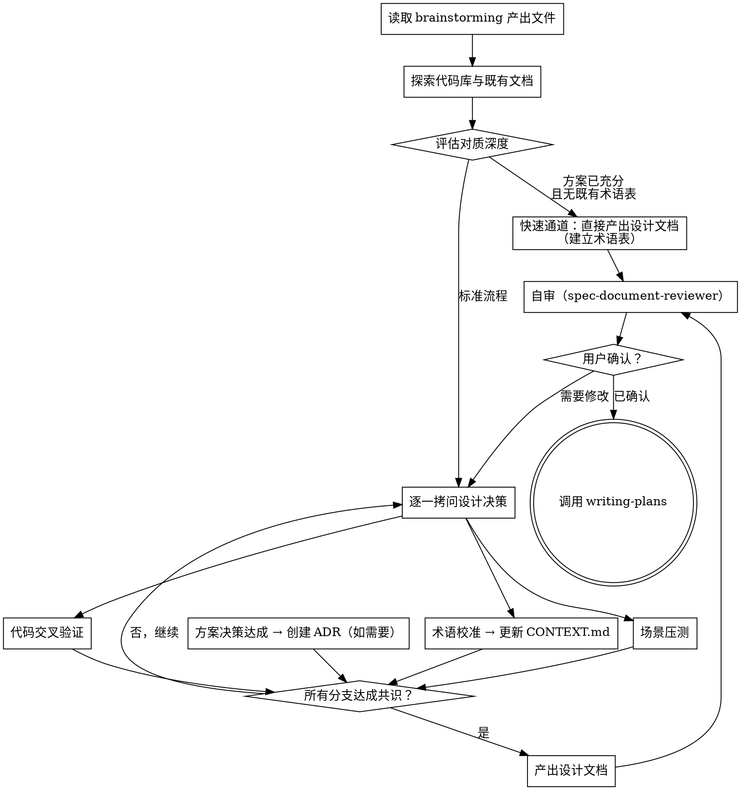

# 领域对质与方案精炼

接收 brainstorming 产出的需求和方向选型，逐一拷问每个设计决策，直到所有术语精确、方案细节经受住领域模型的检验。将结论即时固化为文档。

**开始时声明：** "我正在使用 grill-with-docs 技能对设计方案进行领域对质。"

<HARD-GATE>
在所有设计分支拷问完毕、术语和方案细节达成共识之前，不得调用 writing-plans 或任何实现技能。
</HARD-GATE>

## 输入

读取 brainstorming 产出的文件 `docs/brainstorming/YYYY-MM-DD-<slug>.md`（具体路径由上游 brainstorming 在交接时提供），其中包含：

- 需求边界和成功标准
- 方向选型（选定的大方向及理由）
- 如有多 Stage 分割，根据 Stage 进度清单定位当前未完成的 Stage，读取对应的 Stage 章节作为输入

## 输出

1. **设计文档** — 经过领域对质后的完整设计，保存到 `docs/grill/YYYY-MM-DD-<slug>.md`（无 Stage）或 `docs/grill/YYYY-MM-DD-<slug>-stage-N.md`（有 Stage）。沿用 brainstorming 确定的 slug。包含：架构、组件、数据流、接口定义、错误处理、测试策略。术语与 `docs/CONTEXT.md` 一致，方案细节经过边界场景验证。
2. **docs/CONTEXT.md** — 术语表（新建或更新）
3. **docs/adr/NNNN-slug.md** — 在对质过程中即时创建，仅在满足三项条件时

输出的设计文档是 writing-plans 的直接输入。

## 流程



## 过程

### 探索既有文档

进入项目后首先查找：

- `docs/CONTEXT.md` 或 `docs/CONTEXT-MAP.md` — 已有术语表
- `docs/adr/` — 已有架构决策记录
- 代码中的领域模型（实体、值对象、枚举、接口定义）

如果存在 `docs/CONTEXT-MAP.md`，按其指引定位当前话题所属的 context。

### 评估对质深度

探索完毕后，判断是否可以进入快速通道：

- 若以下条件全部满足 → **快速通道**：跳过逐一拷问，直接产出设计文档，在过程中建立术语表
  1. 项目无既有 `docs/CONTEXT.md`
  2. 项目无既有 `docs/adr/`
  3. brainstorming 产出中未引入需要校准的领域特定术语（即所有概念都是通用编程概念，无歧义风险）
- 否则 → **标准流程**：逐一拷问

快速通道不是跳过 grill-with-docs，而是压缩对质深度。术语表和设计文档仍然产出。

### 逐一拷问设计决策

沿设计树的每个分支逐一追问，每次只问一个问题，等待反馈后再继续。对每个问题提供你的推荐答案。

如果某个问题可以通过探索代码库回答，直接去读代码而非追问用户。

拷问的维度：

- **术语精确性** — 用户使用的每个领域术语是否与 CONTEXT.md 一致
- **方案可行性** — 提出的方案在当前代码库结构下是否可行
- **接口边界** — 组件之间的交互契约是否明确
- **错误与边界** — 异常路径和边界情况的处理策略

### 术语校准

当用户使用的术语与 `docs/CONTEXT.md` 中的定义冲突时，立即指出：

> "术语表将 'cancellation' 定义为 X，但你似乎在说 Y — 以哪个为准？"

当用户使用模糊或多义术语时，提出精确的规范命名：

> "你说的 'account' 是指 Customer 还是 User？在这个上下文中它们是不同的概念。"

### 场景压测

用具体场景检验领域关系。构造探测边界情况的场景，迫使用户对概念边界给出精确定义。

### 代码交叉验证

当用户陈述某个机制的工作方式时，检查代码是否一致。发现矛盾时主动暴露：

> "代码中取消操作针对整个 Order，但你刚才说可以部分取消 — 以哪个为准？"

### 更新 docs/CONTEXT.md

术语一旦确认就立刻写入 `docs/CONTEXT.md`。不要等到最后才批量更新。

格式参见 [CONTEXT-FORMAT.md](./CONTEXT-FORMAT.md)。

`docs/CONTEXT.md` 只包含领域术语和关系。不包含实现细节、技术方案、配置项。它是术语表，不是规格文档。

### 创建 ADR

在对质过程中，当某个方案决策达成共识时，立即评估是否需要创建 ADR。不要等到最后批量创建。

仅当以下三项同时满足时才创建 ADR：

1. **难以逆转** — 事后改变主意的代价显著
2. **缺少上下文会令人困惑** — 未来读者会疑惑"为什么这样做"
3. **存在真实权衡** — 确有替代方案，且因具体理由选择了当前方案

格式参见 [ADR-FORMAT.md](./ADR-FORMAT.md)。

## 设计文档结构

拷问完毕后，产出完整设计文档。结构根据复杂度调整，至少包含：

```markdown
# [功能名称] 设计

## 概述
[一段话描述要构建什么、为什么]

## 架构
[系统结构、组件划分、数据流向]

## 接口定义
[组件间的交互契约、公共 API、数据结构]

## 错误处理
[异常路径、降级策略、边界情况]

## 测试策略
[测试层级、关键测试场景]
```

简单功能的设计可以压缩到几段话，但上述维度都需要覆盖。

## 自审

产出设计文档后、向用户展示前，使用 [spec-document-reviewer-prompt.md](./spec-document-reviewer-prompt.md) 中的检查项对设计文档进行自审：

- 完整性：无 TODO、占位符、不完整的部分
- 一致性：无内部矛盾、冲突的需求
- 清晰性：需求歧义不会导致构建错误的东西
- 范围：聚焦到足以生成单个实现计划

发现问题时直接修正，修正后再展示给用户确认。

## 终止条件

满足以下全部条件时，宣布对质完成：

1. 所有设计分支已拷问，无未决问题
2. 术语表已更新（如有变化）
3. ADR 已创建（如有需要）
4. 设计文档通过自审
5. 用户确认设计文档

确认后调用 writing-plans 技能，将设计文档路径作为其输入。

**终止状态是调用 writing-plans。** grill-with-docs 之后唯一调用的技能是 writing-plans。

## 核心原则

- **逐个提问** — 每次一个问题，等待反馈再继续
- **提供推荐** — 对每个问题给出你的推荐答案和理由
- **代码优先** — 能通过读代码回答的问题不要问用户
- **即时固化** — 术语确认后立即写入 CONTEXT.md，决策达成后立即评估是否需要 ADR，不批量处理
- **克制 ADR** — 不满足三项条件的决策不创建 ADR
- **精确优于完整** — 宁可少覆盖几个维度，也不能让任何一个维度含糊
