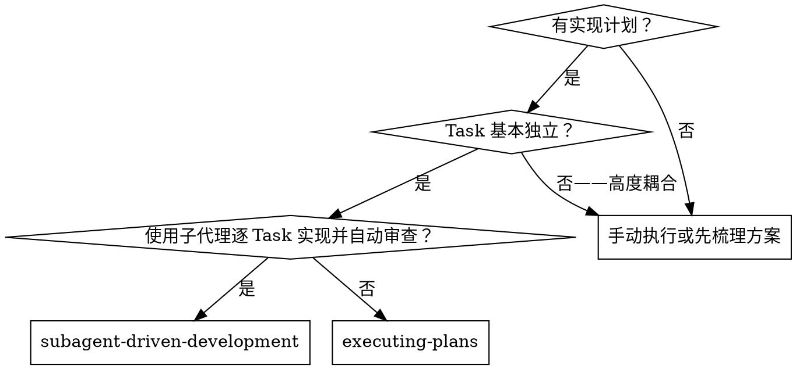
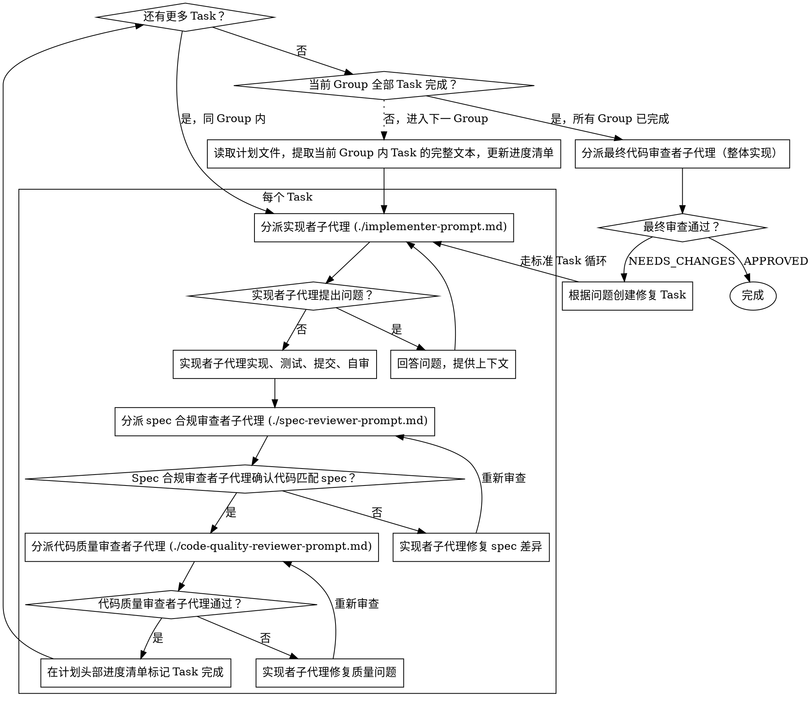

# Subagent-Driven Development（子代理驱动开发）

通过为每个 Task 分派全新的子代理来执行计划，每个 Task 后进行两阶段审查：先是 spec 合规审查，然后是代码质量审查。

分层结构：Task Group 之间串行；同 Group 内 Task 文件互斥，当前按串行执行；Task 内 Step 严格串行。完整定义参见 writing-plans。

**开始时声明：** "我正在使用 subagent-driven-development 技能执行此计划。"

**为什么使用子代理：** 你将 Task 委托给拥有独立上下文的专用代理。通过精确设定其指令和上下文，确保它们保持专注并成功完成 Task。它们不应继承你会话中的上下文或历史——你只构建它们需要的内容。这也能为你自己的协调工作保留上下文。

**核心原则：** 每个 Task 一个全新子代理 + 两阶段审查（先 spec 后质量）= 高质量，快速迭代

**持续执行：** 不要在 Task 之间暂停与用户确认。不间断地执行计划中的所有 Task。同 Group 内的 Task 按串行顺序逐个推进，Group 全部完成后进入下一 Group。唯一停止的理由是：无法解决的 BLOCKED 状态、真正阻碍进展的歧义，或所有 Task 已完成。"我应该继续吗？"这类提示和进度摘要是在浪费用户时间——用户要求你执行计划，那就执行它。

## 何时使用



**对比 Executing Plans：**
- 同一会话（无需上下文切换）
- 每个 Task 全新子代理（无上下文污染）
- 每个 Task 后进行两阶段审查：先 spec 合规，再代码质量
- 更快的迭代（Task 之间无需人工介入）

## 流程


```

## 模型选择

使用每个角色所需的最低能力模型，以节省成本并提高速度。

**机械性实现 Task**（独立函数、清晰 spec、1-2 个文件）：使用快速、廉价的模型。当计划制定得足够清晰时，大多数实现 Task 都是机械性的。

**集成与判断 Task**（多文件协调、模式匹配、调试）：使用标准模型。

**架构、设计与审查 Task**：使用可用的最强模型。

具体模型映射取决于运行环境中可用的模型。如果环境不支持动态切换模型，所有角色使用默认模型。

**Task 复杂度信号：**
- 涉及 1-2 个文件且有完整 spec → 廉价模型
- 涉及多个文件且有集成关注点 → 标准模型
- 需要设计判断或广泛的代码库理解 → 最强模型

## 处理最终审查结果

final-reviewer 返回 NEEDS_CHANGES 时，根据问题列表创建针对性修复 Task，每个修复 Task 走标准的「实现者 → spec 审查 → 代码审查」循环。全部修复 Task 完成后重新分派 final-reviewer，直到返回 APPROVED。

## 处理实现者状态

实现者子代理报告四种状态之一。适当处理每种状态：

**DONE：** 进入 spec 合规审查。

**DONE_WITH_CONCERNS：** 实现者完成了工作但标记了疑虑。在继续之前阅读这些顾虑。如果顾虑涉及正确性或范围，在审查之前解决它们。如果是观察性意见（例如"这个文件越来越大了"），记录它们并进入审查。

**NEEDS_CONTEXT：** 实现者需要未提供的信息。提供缺失的上下文并重新分派。

**BLOCKED：** 实现者无法完成 Task。评估阻塞原因：
1. 如果是上下文问题，提供更多上下文并用相同模型重新分派
2. 如果 Task 需要更强的推理能力，使用更强的模型重新分派
3. 如果 Task 太大，将其拆分为更小的部分
4. 如果计划本身有问题，按回退判断规则升级

**绝不**忽略升级或在没有任何改变的情况下强制同一模型重试。如果实现者说卡住了，就一定有需要改变的地方。

## 回退判断

遇到阻塞时，根据问题根因判断应回退到哪个上游 skill：

- Task 因接口定义不清或组件交互契约缺失而阻塞 → 回退到 grill-with-docs 补充设计
- Task 因需求范围不明或方向有误而阻塞 → 回退到 brainstorming 重新评估
- Task 因 Step 描述不足但设计本身没问题 → 回退到 writing-plans 补充计划细节
- Task 因实现技术难题而阻塞 → 当前层级解决（换模型、拆分 Task、提供更多上下文）

## 提示词模板

- `./implementer-prompt.md` - 分派实现者子代理
- `./spec-reviewer-prompt.md` - 分派 spec 合规审查者子代理
- `./code-quality-reviewer-prompt.md` - 分派代码质量审查者子代理
- `./final-reviewer-prompt.md` - 分派最终代码审查者子代理（整体实现）

## 示例工作流程

```
你：我正在使用 Subagent-Driven Development 来执行此计划。

[读取计划文件 docs/plans/2026-05-18-git-hooks.md]
[理解 Group 划分
  Group 1: Task 1-1, Task 1-2 (文件互斥已验证)
  Group 2: Task 2-1]

--- Group 1 ---

=== Task 1-1：Hook 安装脚本 ===

[获取 Task 1-1 文本和上下文]
[使用完整 Task 文本 + 上下文分派实现者子代理]

实现者："开始之前——Step 1 说要在用户级别安装 hook，安装路径是哪里？"

你："用户级别 (~/.config/hooks/)"

实现者："明白了。现在根据 Step 要求开始实现……"
[稍后] 实现者：
  - 根据 Step 1 描述的要求实现了 install-hook 命令
  - 根据 Step 2 的测试场景列表编写了测试，5/5 通过
  - 自审通过
  - 已提交

[分派 spec 合规审查者]
Spec 审查者：Spec 合规——所有需求已满足，无多余内容

[分派代码质量审查者]
代码审查者：测试覆盖良好，代码干净。通过。

[在进度清单标记 Task 1-1 完成]
[继续 Task 1-2、Task 2-1...]

[所有 Task 完成后]
[分派最终代码审查者]
最终审查者：所有需求已满足，可以合并

[如果当前是某个 Stage 的计划，在 brainstorming 产出文件中标记该 Stage 完成]
[存在后续 Stage 时向用户交接：「Stage N 已完成，进度清单已更新。下一步需回到 brainstorming 对 Stage N+1 进行续接。是否继续？」]

完成！
```

## 优势

**对比手动执行：**
- 子代理自然遵循 TDD
- 每个 Task 全新上下文（不会混淆）
- 并行安全（子代理不会互相干扰）
- 子代理可以提问（工作前和工作期间均可）

**对比 Executing Plans：**
- 同一会话（无需交接）
- 持续进展（无需等待）
- 自动审查检查点

**效率提升：**
- 无需文件读取开销（控制器提供完整 Task 文本）
- 控制器精确筛选所需上下文
- 子代理预先获得完整信息
- 问题在工作开始前提出（而非之后）

**质量关卡：**
- 自审在交接前捕获问题
- 两阶段审查：Spec 合规，然后是代码质量
- 审查循环确保修复真正有效
- Spec 合规防止过度构建或构建不足
- 代码质量确保实现构建良好

**成本：**
- 更多子代理调用（每个 Task：实现者 + 2 个审查者）
- 控制器做更多前期工作（预先提取所有 Task）
- 审查循环带来额外迭代
- 但早期捕获问题比后续调试成本更低

## 红线

**绝不：**
- 未经用户明确同意在 main/master 分支上开始实现
- 跳过审查（spec 合规或代码质量任一）
- 带着未修复的问题继续
- 并行分派多个实现者子代理（会导致冲突）
- 让子代理自行读取计划文件（应提供完整 Task 文本）
- 跳过场景设定上下文（子代理需要理解 Task 在整个计划中的位置）
- 忽略子代理的提问（在让他们继续之前必须回答）
- 接受 spec 合规"差不多"（spec 审查者发现问题 = 未完成）
- 跳过审查循环（审查者发现问题 = 实现者修复 = 再次审查）
- 让实现者自审替代实际审查（两者都需要）
- **在 spec 合规通过之前开始代码质量审查**（顺序错误）
- 在任一审查仍有未解决问题时进入下一个 Task

**如果子代理提出问题：**
- 清晰完整地回答
- 必要时提供额外上下文
- 不要催促他们进入实现阶段

**如果审查者发现问题：**
- 实现者（同一子代理）修复问题
- 审查者再次审查
- 重复直到通过
- 不要跳过重新审查

**如果子代理任务失败：**
- 用具体指令分派修复子代理
- 不要尝试手动修复（会污染上下文）

## SHA 追踪

每个 Task 开始前记录当前 commit SHA，作为该 Task 的 code-quality-reviewer BASE_SHA。首个 Task 开始前的 SHA 同时作为 final-reviewer 的 BASE_SHA。

## 终止状态

所有 Task 完成并通过最终代码审查后，向用户报告结果。如果当前是某个 Stage 的计划且存在未完成的后续 Stage，在 brainstorming 产出文件（`docs/brainstorming/YYYY-MM-DD-<slug>.md`）的 `## Stage 进度` 章节中将当前 Stage 的 `- [ ]` 改为 `- [x]`，不修改文件的其他部分。然后向用户交接：「Stage N 已完成，进度清单已更新。下一步需回到 brainstorming 对 Stage N+1 进行续接。是否继续？」如果无后续 Stage，流程结束。

## 集成

**相关技能：**
- **writing-plans 技能** - 创建本技能所执行的计划（产生 Task Group — Task — Step 层级）
- **code review 流程** - 为审查者子代理提供代码审查规范
- **test-driven-development 技能** - 子代理在每个 Task 中遵循 TDD

**替代工作流：**
- **executing-plans 技能** - 在当前会话中自行实现，配合审查检查点
