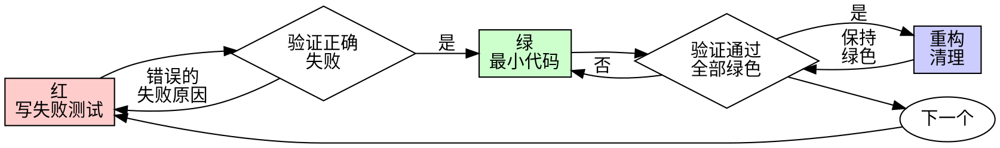

# 测试驱动开发 (TDD)

## 概述

先写测试。看它失败。写最小代码使其通过。

**核心原则：** 如果你没看到测试失败，你就不知道它是否测试了正确的东西。

```
没有先写失败测试，就没有生产代码
```

在测试之前写了代码？删除它。从 TDD 重新开始。

## 何时使用

| 场景 | 行为 |
|------|------|
| 新功能、Bug 修复、重构、行为变更 | **必须** TDD |
| 一次性原型、生成的代码、配置文件 | 询问用户 |

## 红-绿-重构



### 红

写一个最小测试，展示应该发生什么。要求：
- 测试一个行为
- 名称描述行为（而非模糊的 "test1"）
- 使用真实代码，除非不可避免才用 mock

### 验证红

运行测试。必须看到测试因为功能缺失而失败（而非拼写错误导致报错）。

- 测试通过了？你在测试已有行为。修正测试。
- 测试报错了？修正错误，重新运行直到正确失败。

### 绿

写最简单的代码使测试通过。不要添加未被测试要求的功能。

### 验证绿

运行测试。确认测试通过、其他测试未失效、输出干净。

- 测试失败？修正代码，不是测试。
- 其他测试失败？立即修正。

### 重构

只在绿色通过后：移除重复、改进命名、提取辅助函数。保持测试绿色。不要添加行为。

重复：为下一个功能写下一个失败测试。

## Bug 修复流程

发现 bug → 写重现该 bug 的失败测试 → 遵循红-绿-重构循环 → 测试通过证明修复并防止回归。

绝不在没有测试的情况下修复 bug。

## 为什么测试先行

后写的测试立即通过，证明不了什么——它可能测试了错误的东西，或受实现偏见影响而遗漏边界情况。

测试先行迫使你看到测试失败，证明它确实在测试需要的东西。测试先行回答「这应该做什么？」；测试后行回答「这做了什么？」——后者验证的是你记得的边界情况，而非需要发现的边界情况。

## 常见合理化借口

| 借口 | 现实 |
|--------|---------|
| "太简单不需要测试" | 简单代码也会出错。测试只需 30 秒。 |
| "我之后再测试" | 立即通过的测试证明不了什么。 |
| "后写测试达到同样目标" | 后写测试 = "这做了什么？" 先写测试 = "这应该做什么？" |
| "已经手动测试过了" | 临时 ≠ 系统性。无记录，无法重新运行。 |
| "删除 X 小时是浪费" | 沉没成本谬误。保留未验证的代码是技术债务。 |
| "保留作为参考，先写测试" | 你会改编它。那就是后写测试。删除就是删除。 |
| "需要先探索" | 可以。丢掉探索成果，从 TDD 开始。 |
| "测试难 = 设计不清晰" | 倾听测试。难测试 = 难使用。 |
| "TDD 会让我变慢" | TDD 比调试快。务实 = 测试先行。 |
| "手动测试更快" | 手动不证明边界情况。你每次改动都要重新测试。 |
| "现有代码没有测试" | 你正在改进它。为现有代码添加测试。 |

## 测试的本质

测试是业务说明书，不是覆盖率工具。"测试全部通过"仅仅是底线，不是最终目标。不能为了应付覆盖率而机械地写测试。

测试用例不仅要断言代码"做了什么"（输入 A 得到 B），更必须清晰表达这种行为为什么重要。测试必须对业务逻辑的变更极其敏感：如果业务规则发生了改变而相关测试没有失败，或者根本无法写出一个能准确验证该业务变化的测试，这反过来说明被测函数的设计本身有问题。

## 好的测试

| 品质 | 好 | 坏 |
|------|-----|-----|
| 最小 | 一件事。名称中有"和"？拆分它。 | 单个测试验证多个行为 |
| 清晰 | 名称描述行为 | 模糊的 "test1" |
| 展示意图 | 演示期望的 API | 掩盖代码应该做什么 |
